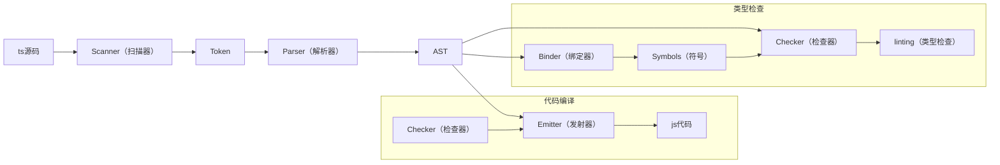

# 作用

TS可以帮助开发者在开发环境规避语法错误、变量名错误、类型错误等等，最终还是需要通过一些工具比如TSC、deno等工具编译成JS代码，然后才能在JS宿主环境运行。

# 编译原理

## 如何编译

可以通过TSC来编译代码：

```bash
# 全局安装typescript
npm install typescript -g
```

```ts
// test.ts
const username: string = 'zhen'
console.log(username)
```

对于上述文件，在同级执行：

```bash
tsc test.ts
```

同级目录下会生成`test.js`：

```js
// test.js
var username = 'zhen';
console.log(username);
```

## 流程



## 原理