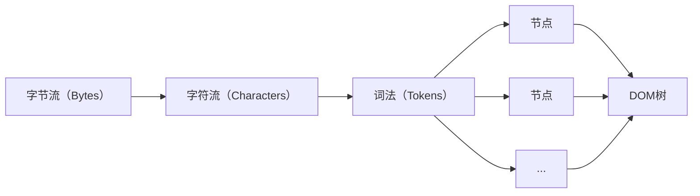
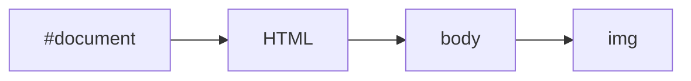
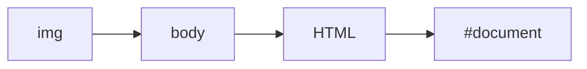

# 第五章：HTML 解释器和 DOM 模型

## HTML解释器



上图描述了资源从字节流到DOM树的大致过程。从**字符流**到**词法**的过程是词法分析，在这之前，解释器首先要做的事情就是检查该网页内容使用的编码格式，以便后面使用合适的解码器。词法分析本质是一个状态机。

对于Chromium，在Renderer进程使用独立的线程用来处理HTML文档的解释任务——线程化的解释器，也就是说构建DOM树的过程只能在渲染线程中进行，但是从**字符流**到**词法**这个阶段会交给单独的线程来做。

WebKit将DOM树创建过程中将需要执行的JS代码交给JS引擎执行（这个时候不能访问DOM树)，此过程于前端开发人员非常熟悉。DOM树创建过程中如果遇到JS代码，WebKit会使用预扫描器扫描后面的Tokens。如果WebKit发现它们需要使用其他资源，那么使用预资源加载器请求资源，预扫描器本身不创建节点对象，也不会构建DOM树，所以速度比较快。

当DOM树构建完之后，WebKit触发`DOMContentLoaded`事件，注册在该事件上的JavaScript函数会被调用。当所有资源都被加载完之后，WebKit触发`onload`事件。

## DOM的事件机制

事件存在俩个主体：事件（Event）和实践目标（EventTarget），当渲染引擎接收到一个事件的时候，它会通过HitTest（WebKit中的一种检查触发事件在哪个区域的算法）检查哪个元素是直接的事件目标。

对于事件目标，存在俩个过程：捕获（Capture）和冒泡（Bubble）。

```html
<html>
    <head>
        <style></style>
    </head>
    <body>
        
        <script></script>
    </body>
</html>
```

假设对于上面的HTML文档，用户点击了`img`，首先是事件捕获：



然后是冒泡：



基于WebKit的浏览器事件处理过程，首先是做HitTest，查找事件发生处的元素，检测该元素有无监听者。如果网页的相关节点注册了事件的监听者，那么浏览器会把事件派发给WebKit内核来处理。

## Shadow DOM

Shadow DOM是DOM的子树，不会直接暴露给用户，比如HTML5特性中`video`、`audio`等标签都是Shadow DOM，它们内部封装了复杂的逻辑和节点。Shadow DOM不会影响事件机制，不过需要WebKit特别判断（会对ShadowRoot对象作出特别处理）。

# 第六章：CSS解释器和样式布局

DOM构建完成后会进行CSSOM的构建。CSSOM同DOM一样是树结构且可以被JS修改，CSS在规范迭代中不断丰富网页内容开发，比如CSSOM View规范会增加一些交互信息属性到Window、Document、Element等接口上，比如窗口大小、网页滚动位移、元素的框位置、鼠标事件的坐标等信息。