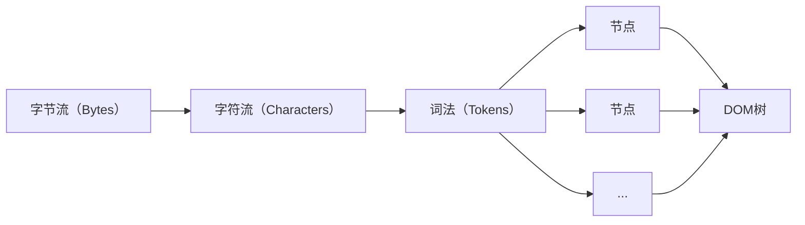
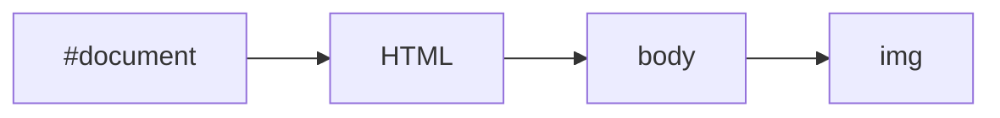
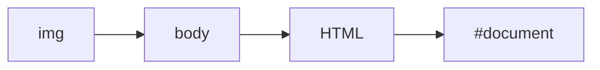
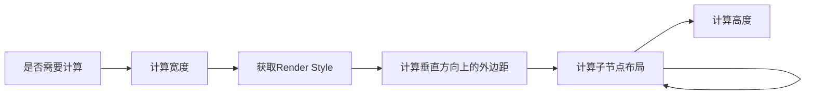
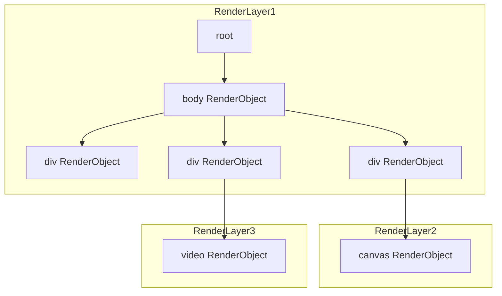

《WebKit技术内幕》是我在知乎上**得到**的一本书，出发点源于自己的学习方向——前端跨端，一如Electron、Flutter这类框架。个人感觉这本书适合具有一定前端开发经验的读者，或者从事更底层开发（浏览器项目开发）的人阅读。同时此书中虽然列举了很多实践，但是明显与版本脱钩（书籍出版年限2014年），如果你有相关项目代码辅助阅读更好。然后我是在微信读书APP上购买了此书，链接[https://weread.qq.com/web/bookDetail/4b332350813ab7c27g013503](https://weread.qq.com/web/bookDetail/4b332350813ab7c27g013503)。

> 本篇（系列）文章只是对原文章作总结，有些内容虽然是直接摘抄下来的，但是不代表具备权威性（有些内容老旧），请读者斟酌。
>
> 本篇（系列）文章相较于原文忽略了很多内容，比如实践（代码）、前端开发基础内容等，建议读者将本文做为二手阅读。

# 第五章：HTML 解释器和 DOM 模型

## 5.2 HTML解释器



上图描述了资源从字节流到DOM树的大致过程。从**字符流**到**词法**的过程是词法分析，在这之前，解释器首先要做的事情就是检查该网页内容使用的编码格式，以便后面使用合适的解码器。词法分析本质是一个状态机。

对于Chromium，在Renderer进程使用独立的线程用来处理HTML文档的解释任务——线程化的解释器，也就是说构建DOM树的过程只能在渲染线程中进行，但是从**字符流**到**词法**这个阶段会交给单独的线程来做。

WebKit将DOM树创建过程中将需要执行的JS代码交给JS引擎执行（这个时候不能访问DOM树)，此过程于前端开发人员非常熟悉。DOM树创建过程中如果遇到JS代码，WebKit会使用预扫描器扫描后面的Tokens。如果WebKit发现它们需要使用其他资源，那么使用预资源加载器请求资源，预扫描器本身不创建节点对象，也不会构建DOM树，所以速度比较快。

当DOM树构建完之后，WebKit触发`DOMContentLoaded`事件，注册在该事件上的JavaScript函数会被调用。当所有资源都被加载完之后，WebKit触发`onload`事件。

## 5.3 DOM的事件机制

事件存在俩个主体：事件（Event）和实践目标（EventTarget），当渲染引擎接收到一个事件的时候，它会通过HitTest（WebKit中的一种检查触发事件在哪个区域的算法）检查哪个元素是直接的事件目标。

对于事件目标，存在俩个过程：捕获（Capture）和冒泡（Bubble）。

```html
<html>
    <head>
        <style></style>
    </head>
    <body>
        
        <script></script>
    </body>
</html>
```

假设对于上面的HTML文档，用户点击了`img`，首先是事件捕获：



然后是冒泡：



基于WebKit的浏览器事件处理过程，首先是做HitTest，查找事件发生处的元素，检测该元素有无监听者。如果网页的相关节点注册了事件的监听者，那么浏览器会把事件派发给WebKit内核来处理。

## 5.4 Shadow DOM

Shadow DOM是DOM的子树，不会直接暴露给用户，比如HTML5特性中`video`、`audio`等标签都是Shadow DOM，它们内部封装了复杂的逻辑和节点。Shadow DOM不会影响事件机制，不过需要WebKit特别判断（会对ShadowRoot对象作出特别处理）。

# 第六章：CSS解释器和样式布局

DOM构建完成后会进行CSSOM的构建。CSSOM同DOM一样是树结构且可以被JS修改，CSS在规范迭代中不断丰富网页内容开发，比如CSSOM View规范会增加一些交互信息属性到Window、Document、Element等接口上，如窗口大小、网页滚动位移、元素的位置、鼠标事件的坐标等信息。

## 6.1 CSS基本功能

### 6.1.4 盒子模型
> 原文中将**Box Model**称为**框模型**，以下将统称为**盒子模型**

盒子模型是布局计算的基础，渲染引擎可以根据模型来理解该如何排版元素以及元素之间的位置关系。


### 6.1.5 包含块（Containing Block）模型

当WebKit计算元素的箱子的位置和大小时，WebKit需要计算该元素和另外一个矩形区域的相对位置，这个矩形区域称为该元素的包含块。

- 根元素的包含块称为初始包含块，通常它的大小就是可视区域(Viewport)的大小。
- 被`position: static;`或`position: relative;`修饰的元素，它的包含块是最近祖先的盒子模型中的内容区域（Content）。
- 被`position: fixed;`修饰的元素，该元素的包含块脱离HTML文档，固定在可视区域的某个特定位置。
- 被`position: absolute;`修饰的元素，该元素的包含块由最近的含有属性`absolute`、`relative`或者`fixed`的祖先决定，具体规则如下：如果一个元素具有`inline`属性，那么元素的包含块是包含该祖先的第一个和最后一个inline框的内边距的区域；否则，包含块则是该祖先的内边距所包围的区域。

### 6.1.7 CSSDOM（CSS Object Model）

DOM提供了接口让JavaScript修改HTML文档，同理，CSSOM提供了接口让JavaScript获得和修改CSS代码设置的样式信息。使用`document.stylesheets`可以查看当前网页中包含的所有CSS样式表。

## 6.3 WebKit布局

布局计算过程：



相对于绘图（Paint），布局（Layout）比较耗时间。当盒子模型中的Margin、Border、Padding、Padding尺寸变更，都有可能触发重新布局，一般发生在以下过程：

- 网页首次被打开
- Animation结束后布局属性被修改
- JS修改CSSOM
- 用户交互

# 第七章 渲染基础

## 7.1 RenderObject树

DOM树中存在**可视节点**和**不可视节点**，不可视节点例如`<head>`、`<script>`、`<meta>`这类标签。WebKit会为以下内容创建RenderObject对象用于内容渲染：

- DOM树的document节点；
- DOM树中的可视节点；
- 某些情况下WebKit需要建立匿名的RenderObject节点，比如Shadow DOM。

也就是说RenderObject树节点和DOM树节点不是一一对应关系。RenderObject对象构成了一棵树，用于后续渲染。

## 7.2 网页层次和RenderLayer树

网页是可以分层的，一是为了方便网页开发者开发网页并设置网页的层次，二是为了WebKit处理上的便利，也就是说为了简化渲染的逻辑。WebKit会为网页的层次创建相应的RenderLayer对象，规则如下：

- DOM树的Document节点对应的RenderView节点；
- DOM树中的Document的子节点，也就是HTML节点对应的RenderBlock节点；
- 显式的指定CSS位置的RenderObject节点；
- 有透明效果的RenderObject节点；
- 节点有溢出(Overflow)、alpha或者反射等效果的RenderObject节点；
- 使用Canvas 2D和3D(WebGL)技术的RenderObject节点；
- Video节点对应的RenderObject节点；

RenderLayer树是基于RenderObject树建立起来的一棵新树，RenderLayer节点和RenderObject节点不是一一对应关系，而是一对多的关系。RenderLayer节点也构成了一棵RenderLayer树。

```html
<html>
    <head>
        <meta name="viewport" content="width=device-width, initial-scale=1.0" />
        <script></script>
        <link rel="stylesheet" href="https://cdnjs.cloudflare.com/ajax/libs/highlight.js/11.8.0/styles/default.min.css">
        <!-- 以上3各标签为不可视节点 -->
    </head>
    <body>
        <div></div>
        <div>
            <canvas></canvas>
            <!-- canvas会分层 -->
        </div>
        <div>
            <video></video>
            <!-- video会分层 -->
        </div>
    </body>
</html>
```



这些RenderLayer节点也构成了一棵RenderLayer树，每个RenderLayer节点包含的RenderObject节点是一棵RenderObject子树。

## 7.3 渲染方式

### 7.3.1 绘图上下文(GraphicsContext)

在WebKit中，绘图操作被定义了一个抽象层，这就是绘图上下文，所有绘图的操作都是在该上下文中来进行的。绘图上下文可以分成两种类型：

- 2D绘图上下文(GraphicsContext)

    绘制2D图形的上下文，提供基本绘图单元的绘制接口以及设置绘图的样式，绘图接口包括画点、画线、画图片、画多边形、画文字等，绘图样式包括颜色、线宽、字号大小、渐变等。

- 3D绘图上下文(GraphicsContext3D)

    绘制3D图形的上下文

> 上述俩种上下文都是抽象类，在不同移植中实现不同

### 7.3.2 渲染方式

网页的最终渲染结果图像是由多层RenderLayer对象图层叠加在一起，渲染方式有：

- 软件渲染

    使用CPU完成图像的渲染，渲染结果是单一位图（Bitmap）。

- 硬件加速渲染

    使用GPU完成图像的渲染，得到多层图像，然后对多层图像进行合层。

- 混合渲染

    使用CPU和GPU完成图像的渲染，CPU渲染后的图像会传给GPU进行合层。

对于常见的2D绘图操作，使用GPU来绘图不一定比使用CPU绘图在性能上有优势，例如绘制文字、点、线等，原因是CPU的使用缓存机制有效减少了重复绘制的开销而且不需要GPU并行性。其次，GPU的内存资源相对CPU的内存资源来说比较紧张，而且网页的分层使得GPU的内存使用相对比较多。特点如下：

- 软件渲染是目前很常见的技术，也是浏览器最早使用的渲染方式这一技术比较节省内存，特别是更宝贵的GPU内存，但是软件渲染只能处理2D方面的操作。简单的网页没有复杂绘图或者多媒体方面的需求，软件渲染方式就比较合适来渲染该类型的网页。问题是，一旦遇上了HTML5的很多新技术，软件渲染显然无能为力，一是因为能力不足，典型的例子是CSS3D、WebGL等；二是因为性能不好，例如视频、Canvas 2D等。所以，软件渲染技术被使用得越来越少，特别是在移动领域。软件渲染同硬件加速渲染另外一个很不同的地方就是对更新区域的处理。当网页中有一个更新小型区域的请求（如动画）时，软件渲染可能只需要计算一个极小的区域，而硬件渲染可能需要重新绘制其中的一层或者多层，然后再合成这些层。硬件渲染的代价可能会大得多。
- 对于硬件加速的合成化渲染方式来说，每个层的绘制和所有层的合成均使用GPU硬件来完成，这对需要使用3D绘图的操作来说特别适合。这种方式下，在RenderLayer树之后，WebKit和Chromium还需要建立更多的内部表示，例如GraphicsLayer树、合成器中的层（如Chromium的CCLayer）等，目的是支持硬件加速机制，这显然会消耗更多的内存资源。但是，一方面，硬件加速机制能够支持现在所有的HTML5定义的2D或者3D绘图标准；另一方面，关于更新区域的讨论，如果需要更新某个层的一个区域，因为软件渲染没有为每一层提供后端存储，因而它需要将和这个区域有重叠部分的所有层次的相关区域依次从后向前重新绘制一遍，而硬件加速渲染只需要重新绘制更新发生的层次。因而在某些情况下，软件渲染的代价更大。当然，这取决于网页的结构和渲染策略，这些都是需要重点关注和讨论的。
- 软件绘图的合成化渲染方式结合了前面两种方式的优点，这是因为很多网页可能既包含基本的HTML元素，也包含一些HTML5新功能，使用CPU绘图方式来绘制某些层，使用GPU来绘制其他一些层。原因当然是前面所述的基于性能和内存方面综合考虑的结果。

## 7.4 WebKit软件渲染技术

每个RenderObject对象，有三个阶段：
- 第一阶段是绘制该层中所有块的背景和边框
- 第二阶段是绘制浮动内容
- 第三阶段是前景(Foreground)，也就是内容部分、轮廓（它是CSS标准属性，绘制于元素周围的一条线，位于边框边缘的外围）等部分。

每个阶段可能存在子阶段用于绘制子节点元素，WebKit第一次绘制网页的时候，WebKit绘制的区域等同于可视区域大小。而这在之后，WebKit只是首先计算需要更新的区域，然后绘制同这些区域有交集的RenderObject节点。

# 第八章 硬件加速机制

## 8.1 硬件加速基础

软件渲染（CPU渲染）可以通过只计算更新的区域渲染，但是GPU不行，计算更新部分会带来更大的消耗，所以GPU会对RenderLayer**做更精细的划分**。为了节省GPU的内存资源，硬件加速机制在RenderLayer树建立之后需要做三件事情来完成网页的渲染：

- WebKit决定将哪些RenderLayer对象组合在一起，形成一个有后端存储的新层，这一新层不久后会用于之后的**合成(Compositing)**，这里称之为**合成层(Compositing Layer)**。每个新层都有一个或者多个后端存储，这里的后端存储可能是GPU的内存。对于一个RenderLayer对象，如果它没有后端存储的新层，那么就使用它的父亲所使用的合成层。
- 将每个合成层包含的这些RenderLayer内容绘制在合成层的后端存储中。
- 由合成器(Compositor)将多个合成层合成起来，形成网页的最终可视化结果，实际就是一张图片。合成器是一种能够将多个合成层按照这些层的前后顺序、合成层的3D变形等设置而合成一个图像结果的设施

可以成为**合成层**的RenderLayer对象具有以下特征：

- RenderLaye具有CSS 3D属性或者CSS透视效果。
- RenderLayer包含的RenderObject节点表示的是使用硬件加速的视频解码技术的HTML5`<video>`元素。
- RenderLayer包含的RenderObject节点表示的是使用硬件加速的Canvas 2D元素或者WebGL技术。
- RenderLayer使用了CSS透明效果的动画或者CSS变换的动画。
- RenderLayer使用了硬件加速的CSS Filters技术。
- RenderLayer使用了剪裁(Clip)或者反射(Reflection)属性，并且它的后代中包括一个合成层。
- RenderLayer有一个Z坐标比自己小的兄弟节点，且该节点是一个合成层。

合并一些层，变成合成层可以减少GPU内存的使用，减少重绘性能和处理上的困难，能够显著提升特殊层的性能（WebGL等）。

> 前端开发者可以联想提升网页渲染性能的问题，是不是在这里和一些HTML标签、CSS属性有重叠？


## 8.2 Chromium的硬件加速机制

### 8.2.2 框架

在Chromium中，有个比较特别的设计，就是所有使用GPU硬件加速（也就是调用OpenGL编程接口）的操作都是由一个进程（称为GPU进程）负责来完成的，这其中包括使用GPU硬件来进行绘图和合成。Chromium是多进程架构，每个网页的Renderer进程都是将之前介绍的3D绘图和合成操作通过IPC传递给GPU进程，由它来统一调度并执行。

在Chrome的Android版本中，GPU进程并不存在，Chrome是将GPU的所有工作放在Browser进程中的一个线程来完成，这得益于结构设计的灵活性。但是本质上，GPU进程和GPU线程并无太大区别。

GPU进程和Renderer进程通过以下

GPU进程处理一些命令后，会向Renderer进程报告自己当前的状态，Renderer进程通过检查状态信息和自己的期望结果来确定是否满足自己的条件，从而实现GPU进程和Renderer进程的同步。GPU进程最终绘制的结果不再像软件渲染那样通过共享内存传递给Browser进程，而是直接将页面的内容绘制在浏览器的标签窗口内。

### 8.2.4 Chromium合成器(Chromium Compositor)

> 这里是一堆抽象类，完全看不懂

#### 8.2.4.3 合成过程


合成工作由调度器调度，共四步：

- 创建合成结果的空间Surface

    **Compositor**线程首先创建合成器需要的输出结果的后端存储，在调度器执行该任务时，该线程会将任务交给主线程来完成。主线程会创建后端存储并把它传回给**Compositor**线程。

- 开始一个新的帧(Begin Frame)，包括计算滚动和缩放大小、动画计算、重新计算网页的布局、绘制每个合成层等

    Compositor”线程告诉主线程需要开始绘制新的一帧，同样是通过线程间通信来传递任务。
    
- 将Layer树中包含的这些变动同步到LayerImpl树中
- 合成LayerImpl树中的各个层并交换前后帧缓冲区，完成一帧的绘制和显示动作

    经过第三步之后，**Compositor**线程实际上已经不再需要主线程的参与就能够完成合成工作了，这时该线程有了合成这些层需要的一切资源。这样就能够解释渲染线程在做其他事情的时候，网页滚动等操作并不会受到渲染线程的影响，因为这时候合成器的工作线程仍然能够正常进行，合成器线程继续合成当前的各个合成层生成网页结果，虽然此时可能有些内容没有更新，但用户根本感觉不到网页被阻塞等问题，浏览网页的用户体验更好。

## 8.3 其他硬件加速模块

2D 图形的硬件加速机制：使用 GPU 来绘制 2D 图形的方法即为 2D 图形的硬件加速机制。2D 绘图本身使用 2D 的图形上下文，一般使用软件方式（光栅化）来绘制。2D 图形硬件加速应用场景：

网页基本元素的绘制
canvas 元素，用来绘制 2D 图形