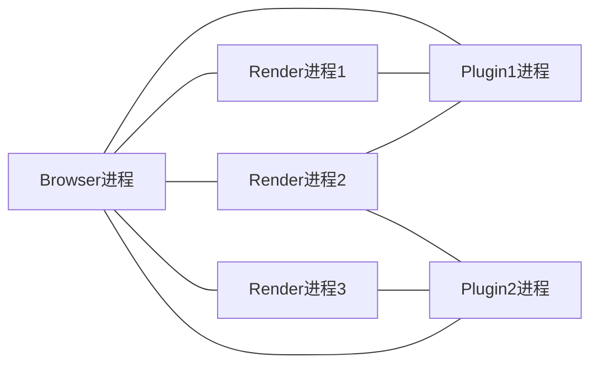

《WebKit技术内幕》是我在知乎上**得到**的一本书，出发点源于自己的学习方向——前端跨端，一如Electron、Flutter这类框架。个人感觉这本书适合具有一定前端开发经验的读者，或者从事更底层开发（浏览器项目开发）的人阅读。同时此书中虽然列举了很多实践，但是明显与版本脱钩（书籍出版年限2014年），如果你有相关项目代码辅助阅读更好。然后我是在微信读书APP上购买了此书，链接[https://weread.qq.com/web/bookDetail/4b332350813ab7c27g013503](https://weread.qq.com/web/bookDetail/4b332350813ab7c27g013503)。

> 本篇（系列）文章只是对原文章作总结，有些内容虽然是直接摘抄下来的，但是不代表具备权威性（有些内容老旧），请读者斟酌。
>
> 本篇（系列）文章相较于原文忽略了很多内容，比如实践（代码）、前端开发基础内容等，建议读者将本文做为二手阅读。

# 第九章 JavaScript引擎

## 9.1 概述

JS是动态类型、**解释型**语言（这种概况不太准确，比如在V8的实现更偏向于编译型语言），一般作为脚本运行在WEB环境。对于C++这种强类型编译型语言，在属性访问时，C++依据对象地址以及初始size字节便可访问对象属性，而JS则类似需要通过字符串匹配才能访问属性，存在巨大性能差异。为了弥补性能问题，JS引擎的诸多实践中引入了JIT技术（Just In Time），该技术会将JS直接编译为本地代码（机器码），大幅度提升性能。

JS引擎包括以下几个部分：

- 编译器：将源代码编译成抽象语法树；
- 解释器：接受字节码然后解释执行，依赖垃圾回收机制；
- JIT工具：将字节码或抽象语法树转换为机器码；
- 垃圾回收器和分析工具（Profiler）：负责垃圾回收和收集引擎中的信息，帮助改善引擎的性能和功效。


## 9.2 V8引擎

### 9.2.2 工作原理

V8中数据的表示分为俩部分：

- 数据实际内容：长度不固定，且内容类型不同，比如`String`、`Object`等；
- 数据句柄（handle）：包含指向数据的指针，除了极少数的数据类型比如`int`、`bool`类型存储在句柄中，其他类型都存储在堆中（因为长度不固定）。

V8首先使用解释器将**源代码**转变成**抽象语法树**，通过JIT编译器的全代码生成器(full code generator)从抽象语法树直接生成本地代码（机器码），所以没有像Java一样的虚拟机或者字节码解释器，这样做可以减少抽象语法树到字节码的转换时间。但是也存在一些缺点：

- 一些场景没有必要将JS转换为本地代码（机器码）
- 缺少源码到本地代码（机器码）的中间态，不同OS移植性维护成本高，比如Java在抽象语法树之后会编译成字节码以支持不同OS移植，然后使用解释器转换为本地代码（机器码）。

为了使JS能够在不同的操作系统运行，且本地代码（机器码）跟具体的硬件平台密切相关，V8使用了多个后端来生成对应的代码。虽然JIT技术太幅度提升了JS的性能，但是缺少中间表示层（字节码），导致性能没法进一步优化，V8在后续又做了很多大的变动：

- 延迟（deferred）：很多JavaScript代码的编译直到运行的时候被调用到才会发生，这样可以减少时间开销；
- 引入Crankshaft编译器

    Crankshaft编译器主要针对那些热点函数进行优化。该编译器基于JavaScript源代码开始分析，而不是本地代码（机器码）。

- 优化回滚（Deoptimization）

    Crankshaft编译器在优化时会优先假定变量类型不会变动，然后生成高效的本地代码（机器码）。如果变量类型中途发生改变，它会回滚到代码优化前的一般情况，这个过程会更低效。

- 隐藏类（Hidden Class）和内嵌缓存（Inline Cache）

    V8使用类和偏移位置思想，将本来需要通过字符串匹配来查找属性值的算法改进为使用类似C++编译器的偏移位置的机制来实现，这就是隐藏类。
    
    隐藏类之上还可以使用缓存来避免重复查询，也就是将之前查找的隐藏类和偏移值保存下来。当下次查找的时候，首先比较当前对象是否也是之前的隐藏类，如果是的话，可以直接使用之前缓存的偏移值，从而减少查找表的时间，即内嵌缓存。

V8管理分为俩部分：

- 内存分配
    - 堆内存

        V8使用堆来管理JavaScript使用的数据，以及生成的代码、哈希表等。

    - Zone Memory

        > 原文中介绍的是抽象Zone类，v8中为[Zone Memory](https://v8.dev/blog/optimizing-v8-memory#zone-memory-reduction)

        Zone Memory主要供内部虚拟机操作（Internal VM operations）使用，特点是每次申请都是一整块的（小）内存（Chunk），用完就全部释放，避免了对细微内存的管理。缺点是内存利用率低，如果存在程序长时间占用内存，会导致内存不足。

- 垃圾回收机制

    V8将堆分成三个部分，第一个是年轻分代，第二个是年老分代，其中还分成多个子部分，第三个是为大对象保留的空间。

    

    对于年轻分代，主要是为新创建的对象分配内存空间，因为年轻分代中的对象较容易被要求回收，为了方便垃圾回收，可以使用复制方式，将年轻分代分成两半，一半用来分配，另外一半在回收的时候负责将之前还需要保留的对象复制过来。对于年轻分代，经常需要进行垃圾回收。而对于年老分代，主要是根据需要将年老的对象、指针、代码等数据使用的内存较少地做垃圾回收。而对于大对象空间，主要是用来为那些需要使用较多内存的大对象分配内存，当然同样可能包含数据和代码等分配的内存，需要注意的是每个页面只分配一个对象。

V8引擎开始启动的时候，需要加载很多内置的全局对象，同时也要建立内置的函数，如Array、String、Math等。为了让引擎更加整洁，加载对象与建立函数等任务都是使用JS文件来实现的，V8引擎负责提供机制来支持，就是在编译和执行输入的JavaScript代码之前，先加载它们。V8引擎需要编译和执行这些内置的JS代码，同时使用堆等来保存执行过程中创建的对象、代码等，这些都需要较多的时间。为此，V8引入了快照机制。快照机制就是将这些内置的对象和函数加载之后的内存保存并序列化。序列化之后的结果很容易被反序列化，经过快照机制的启动时间，可以缩减几毫秒。在编译的时候打开选项“snapshot=on”就可以让V8支持快照机制。在V8中，mksnapshot工具能够帮助生成快照。快照机制同样也能够将一些开发者认为需要的JS文件序列化，以减少以后处理的时间，不过快照机制有一个非常明显的缺点，那就是这些代码没有办法被CrankShaft这样的优化编译器优化，所以存在性能上的问题。

## 实践——高效的JavaScript代码

理论上可以通过以下几种方法编写高效的JS代码，但是一般并不建议读者在语法性能上咬文嚼字（除非代码真的是屎记），相较于语法性能，网络带宽、外部依赖体积等因素更容易导致性能变差。

- 固定变量类型：JS类型是动态确认的，当类型发生改变时会触发优化回滚，产生额外的解析开销。
- 使用简单类型保存数据：简单类型的数据是保存在句柄中的，能够有效减少寻址时间和内存的使用。
- 优化内存使用：对于不需要使用的对象，可以直接将变量设置为空（`obj = null`）。对于属性，不建议使用`delete obj.a`来删除属性，因为这样会产生新的**隐藏类**，反而产生额外的操作
- 减少优化回滚
- 使用新机制：比如`requestAnimationFrame`等接口，并发处理代码，或使渲染和计算任务分离，大大提升引擎并发能力。

# 第十章 插件和JavaScript扩展

## 10.1 NPAPI插件

NPAPI(Netscape Plugin Application Programming Interface)的全称是网景插件应用程序编程接口，最早是由网景公司提出的，用于让浏览器执行外部程序，以支持网页中各种格式的文件，典型的例子是视频、音频和PDF文件等（通过内容类型来区分）。

NPAPI机制被广泛使用，Chromium项目也对其提供支持，不过其有自己独特的架构。NPAPI提供俩类接口：

- 一类以NPP开始，由插件来实现，被浏览器调用，主要包括一些插件创建、初始化、关闭、销毁、信息查询及事件处理、数据流、窗口设置、URL等；
- 另一类以NPN开始，由浏览器来实现，被插件所调用，主要包括图形绘制、数据流处理、浏览器信息查询、内存分配和释放、浏览器的插件设置、URL等。

### 10.1.2 WebKit和Chromium的实现

在Webkit的HTML网页中，可以通过`<embed>`和`<object>`标签使用插件，插件元素会被渲染到单独的层上（像`<video>`元素一样）。插件管理机制的基础是[MIME类型](https://developer.mozilla.org/zh-CN/docs/Web/HTTP/Basics_of_HTTP/MIME_types)和文件扩展名。

NPAPI插件缺乏安全性和稳定性，因为渲染引擎和插件运行在同一个进程中。Chromium为了解决NPAPI存在的问题，会使用沙箱模型隔离插件，限制插件访问本地资源的能力。



在Chromium中，每个插件库只会有一个进程，如果有多个Renderer进程使用同一个插件库，这些Renderer会共享同一个插件库（答案是Chromium在加载插件库后为每个插件使用点在plugin进程中创建一个对应插件实例(PluginInstance)）。

Plugin进程是由Browser进程负责创建和销毁，Renderer进程没有创建的权限，当任何一个Plugin进程**空闲一段时间**后，它才会被销毁。

Plugin进程和Browser进程之间的通信除了创建和管理等，其余消息传递较少，而Renderer进程和Plugin进程之间的消息传递可能会非常多，机制也相对复杂。


# 第十一章 多媒体

## 11.1 HTML5的多媒体支持

HTML5规范出来之前，网页对视频和音频播放的支持基本上都是依靠(Flash)插件来实现，因为HTML语言及相关规范并没有定义视频和音频方面的功能。在HTML5之后，这种情况发生了很大的变化，同文字和图片一样，音频和视频直接成为HTML一系列规范中第一等公民。

- HTML5多媒体内容提供特殊API可供JS调用，比如控制音视频的播放与暂停；
- HTML5多媒体内容支持其他技术操作，比如CSS可以修改图片（transform），开发者可以将视频同Canvas2D或者WebGL结合在一起，这些是Flash插件无法做到的。

实现上述功能大致分为四个部分：

- Webkit基础部分，包括规范的支持：DOM树、RenderObject树和RenderLayer树等对多媒体的支持；
- Chromium的桥接部分：接口的桥接、渲染桥接；
- 依赖其他媒体库：包括ffmpeg、libjingle等第三方项目，使用它们来做多媒体方面的处理；
- Chromium对多媒体资源获取和使用多媒体库来帮助解码等管线化过程的具体实现。Chromium重新实现了整个媒体播放流程，并针对桌面系统和移动系统采用了一些特殊的技术和解决方法。

## 11.2 视频

HTML5提供`<video>`元素用来播放视频资源，对于不同浏览器厂商，支持的播放类型可能不同，所以规范支持`<source>`元素用于适配不同浏览器的不同视频模式。

```html
<video>
    <source src="video.webm" tytpe="video/webm" />
    <source src="video.mp4" tytpe="video/mp4" />
    <source src="video.ogg" tytpe="video/ogg" />
    你的浏览器不支持这类视频播放！
</video>
```

HTML5提供一些属性让开发者使用JavaScript代码检查和操作视频，首先是资源加载和信息方面的接口，开发者可以通过特定接口检查浏览器支持什么格式，如Metadata和海报(Poster)等。其次是缓冲(Buffering)处理，包括缓冲区域、进度等信息。然后是播放方面的状态，包括播放、暂停、终止等。再次是搜寻(Seeking)方面的信息，包括设置当前时间、“Timeupdate”事件，以及两个状态“Seeking”和“seeked”。最后是音量方面的设置，包括获取和设置音量、静音和音量变换等事件。

## 11.4 WebRTC

WebRTC(Web Real Time Communication)技术，中文全称为Web实时通信技术，它是一种提供实时视频通信的规范，目前是W3C推荐的规范。WebRTC既允许使用服务器来进行通信，也支持点对点(Peer-to-Peer)通信，当然需要服务器的辅助。

### 11.4.2 原理和规范


规范包括如下：

- Media Capture and Streams规范和WebRTC对它的扩展，这个主要是依赖摄像头和麦克风来捕获多媒体流，WebRTC对它进行扩展，使得多媒体流可以满足网络传输用途，也就是“video”元素可以来源于多媒体流而不仅仅是资源文件。
- 点到点的连接，也就是规范中的RTCPeerConnection接口，它能够建立端到端的连接，两者直接通过某种方式传输控制信息，至于方式并没有进行规定。
-  RTCDataChannel接口，通过该接口，通信双方可以发送任何类型的消息，例如文本或者二进制数据，这个不是必须的。不过这一功能极大地方便了开发者，其主要思想来源于WebSocket。

