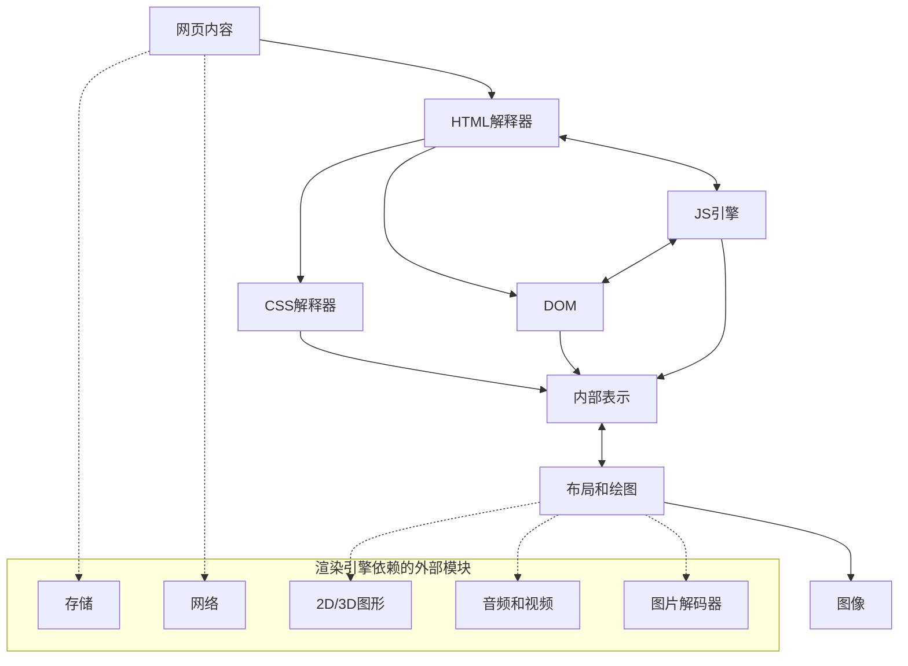
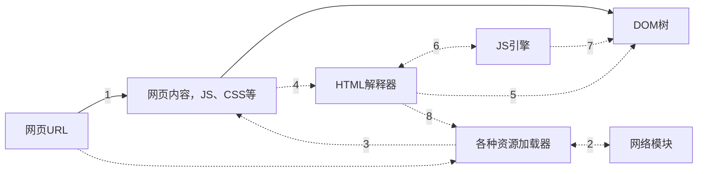
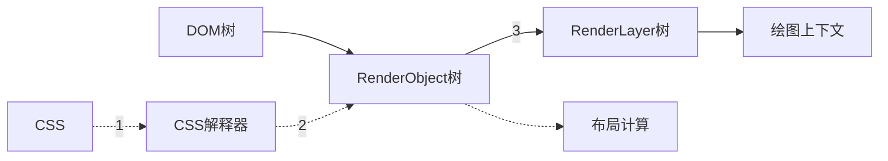
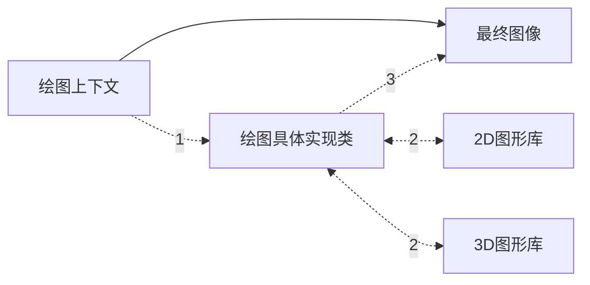
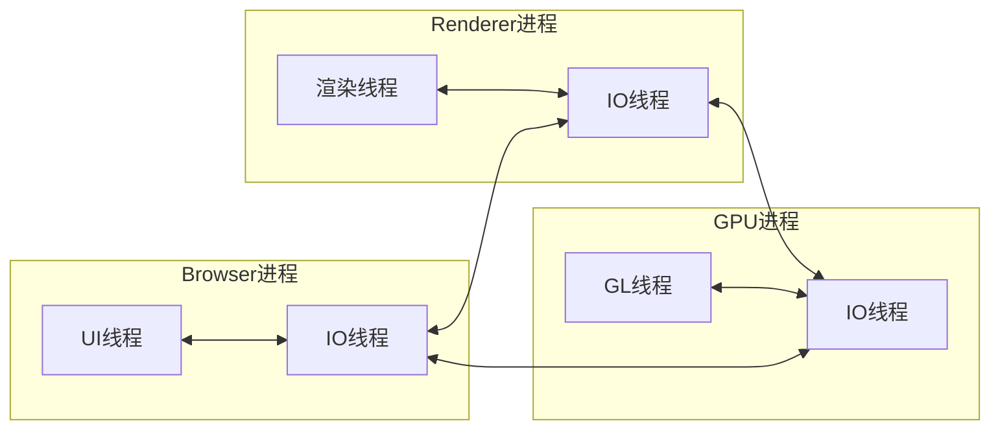

《WebKit技术内幕》是我在知乎上**得到**的一本书，出发点源于自己的学习方向——前端跨端，一如Electron、Flutter这类框架。个人感觉这本书适合具有一定前端开发经验的读者，或者从事更底层开发（浏览器项目开发）的人阅读。同时此书中虽然列举了很多实践，但是明显与版本脱钩（书籍出版年限2014年），如果你有相关项目代码辅助阅读更好。然后我是在微信读书APP上购买了此书，链接[https://weread.qq.com/web/bookDetail/4b332350813ab7c27g013503](https://weread.qq.com/web/bookDetail/4b332350813ab7c27g013503)。

> 本篇（系列）文章只是对原文章作总结，有些内容虽然是直接摘抄下来的，但是不代表具备权威性，请读者斟酌。
>
> 本篇（系列）文章相较于原文忽略了很多内容，比如实践（代码）、HTML5基础内容等，建议读者将本文做为二手阅读。

# 第一章：浏览器和浏览器内核

## 浏览器

### HTML5类别和包含的各种规范

- 离线：Application cache、Local Storage、Index DB、在线/离线事件
- 存储：Application cache、Local Storage、Index DB 等
- 连接：Web Sockets、Server-sent 事件
- 文件访问：File API、File System、File Writer、ProgressEvents
- 语义：各种新的元素，包括 Media、structural、国际化、Link relation、属性、form 类型、microdata 等方面
- 音频和视频：HTML5 Video、Web Audio、WebRTC、Video track 等
- 3D和图形：Canvas 2D、3D CSS 变换、WebGL、SVG等
- 展示：CSS 2D/3D变换、转换（transition）、WebFonts等
- 性能：Web Worker、HTTP caching等
- 其他：触控和鼠标、Shadow DOM、CSS masking 等

### 用户代理（User Agent）

用户代理作用是表明浏览器**身份**，使服务器能够识别客户使用的操作系统及版本、CPU 类型、浏览器及版本、浏览器渲染引擎、浏览器语言、浏览器插件等。比如Chrome的一个字符版本：

```
Mozilla/5.0 (Platform; Encryption; OS-or-CPU; Language) AppleWebKit/AppleWebKitVersion (KHTML, like Gecko) Chrome/ChromeVersion Safari/SafariVersion
```

## 浏览器内核及特性

浏览器内核，即渲染引擎，主要作用是将前端三驾马车渲染成图像。WebKit就是一个渲染引擎，主流的渲染引擎还包括Trident、Gecko。

### 内核特征

渲染引擎主要包含以下模块：

- HTML 解释器：解释 HTML 文本，将 HTML 文本解释成 DOM 树。
- CSS 解释器：级联样式表的解释器，为 DOM 中的各个元素对象计算出样式信息。
- 布局：DOM 创建之后，WebKit 需要将其中的元素对象同样式信息结合起来，计算它们的大小位置等布局信息，形成一个能够表示这所有信息的内部表示模型。
- JavaScript 引擎：JavaScript 引擎能够解释 JavaScript 代码并通过 DOM 接口和 CSSOM 接口来修改网页内容和样式信息，改变渲染结果。
- 绘图：使用图形库将布局计算后的各个网页的节点绘制成图像结果。

除了上面列出的这些模块，还依赖很多其他基础模块，包括网络、存储、2D/3D图形、音频视频和图片解码器等，还应该有调度这些模块的程序。下图是渲染引擎一般渲染过程各阶段依赖的模块。



在渲染完成之后，用户可能持续和渲染结果交互，所以上面的过程会重复进行。

# 第2章：HTML网页和结构

HTML网页是一种半结构化的数据表现形式，结构特征归纳为三种：树状结构、层次结构和框结构。

## 网页构成

一个完整的网页组成包括HTML文本、JavaScript代码、CSS代码以及各种各样的资源文件。网络上的每个资源都是由URL(Unified Resource Locator)标记的，它是URI(Unified Resource Identifier)的一种实现。这表明对于浏览器来讲，区分两个资源是否相同的唯一标准就是它们的URL是否一致。

## 网页结构

### 框结构

框结构包含一个完整的HTML网页，`frameset`、`frame`和`iframe`都可以在一个网页中嵌入新的框结构。

### 层次结构

原文中对于这类结构的描述太过抽象，我们可以从HTML标签去理解。对于一些HTML标签，渲染引擎在处理它们是会对它们**分层**以优化处理性能，这便是层次结构。

## WebKit的网页渲染过程

浏览器的主要作用是将用户输入的URL转变为可视化的图像，书中将其细致为三个过程。

### 从网页URL到DOM树



1. 用户输入 URL ，WebKit 调用其资源加载器加载该 URL 对应的网页
2. 加载器依赖网络模块建立连接，发送请求并接收答复
3. WebKit 接收到各种网页或者资源的数据，其中某些资源可能是同步或异步获取
4. 网页被交给 HTML 解释器转变成一系列词语（Token）
5. 解释器根据词语构建节点（Node），形成 DOM 树
6. 如果节点是 JavaScript 代码，调用 JavaScript 引擎解释并执行
7. JavaScript 代码可能会修改 DOM 树的结构
8. 如果节点需要依赖其他资源，例如图片、CSS、视频等，调用资源加载器来加载它们（异步加载，不会阻碍当前 DOM 树的继续创建）；如果是 JavaScript 资源 URL （并且没有标明以异步方式），需要停止当前 DOM 树的创建知道 JavaScript 资源加载并被 JavaScript 引擎执行后才继续 DOM 树的创建。

在上述的过程中，网页在加载和渲染过程中会发出`DOMConent`事件和DOM的`onload`事件，分别在DOM树构建完之后，以及DOM树建完并且网页所依赖的资源都加载完之后发生，因为某些资源的加载并不会阻碍DOM树的创建，所以这两个事件多数时候不是同时发生的。

### 利用 CSS 和 DOM 树构建 RenderObject 树直到绘图上下文



1. CSS 文件被 CSS 解释器解释成内部表示结构
2. CSS 解释器工作完之后，在 DOM 树上附加解释后的样式信息，即为 RenderObject 树
3. RenderObject 节点在创建的同时，WebKit 会根据网页的层级结构创建 RenderLayer 树，同时构建一个虚拟的绘图上下文

上述过程也会持续重复，所以CSSOM，DOM，RenderObject 树，RenderLayer 树会一直存在直到网页销毁。

### 从绘图上下文到最终的图像



1. 绘图上下文是一个与平台无关的抽象类，它将每个绘图操作桥接到不同的具体实现类，也就是绘图具体实现类
2. 绘图实现类也可能有简单的实现，也可能有复杂的实现。在Chromium中，它的实现相当复杂，需要Chromium的合成器来完成复杂的多进程和GPU加速机制，这在后面会涉及
3. 绘图实现类将2D图形库或者3D图形库绘制的结果保存下来，交给浏览器来同浏览器界面一起显示

这一过程实际上可能不像图中描述的那么简单，现代浏览器为了绘图上的高效性和安全性，可能会在这一过程中引入复杂的机制。而且，绘图也从之前单纯的软件渲染，到现在的GPU硬件渲染、混合渲染模型等方式，这些同样会以单独的章节加以剖析。上述过程同样也是持续重复过程。

# 第3章：WebKit架构和模块

## WebKit架构


上图中虚线部分表示该部分模块在不同浏览器使用的WebKit内核中的实现是不一样的，那其实排除这些基本上没有少一样的。

## 基于Blink的Chromium浏览器结构

### Chromium浏览器的架构及模块


上图描述了Chromium的架构和主要的模块。其中，Blink只是其中的一块，和它并列的还有众多的Chromium模块。在Blink层之上的模块：Content模块和Content接口，是Chromium对渲染网页功能的抽象。它们与Blink（WebKit）渲染网页内容不同，它们更像是一个调度程序，用来调度Blink、V8、沙箱模型等模块。Content模块和Content接口将下层的渲染机制、安全机制和插件机制等隐藏起来，提供一个接口层供上层模块使用。

### 多进程模型和多线程模型

> 这里展示的chromium项目官网展示的最新版本的多进程模型架构图，原图中介绍的太细致不利于查看整体结构。


一般地，浏览器一个tab页代表一个进程，这个便是浏览器多进程模型的表象，其实不止用户的tab页，插件也在多进程模型中被合理考虑。在WebKit内核之上，Chromium率先在WebKit之外引入了多进程模型，更新内容可以查看[Chromium Multi-process Architecture](https://www.chromium.org/developers/design-documents/multi-process-architecture/)。

- Browser 进程：浏览器主进程，负责浏览器界面的显示、各个页面的管理，是所有其他类型进程的祖先，负责它们的创建和销毁等工作，有且仅有一个。
- Renderer 进程：网页的渲染进程，负责页面的渲染工作，Blink/WebKit 的渲染工作主要在这个进程中完成（Renderer 进程数量不一定与用户打开页面的数量一致）
- 其他类型的进程：包括GPU进程、SanBox准备进程（安全机制）

从上面的结构图中可以看到每个进程中又存在多个线程：

- Browser 进程：多线程的主要目的就是为了保持用户界面的高响应度，保证UI线程（Browser进程中的Main thread）不会被任何其他费时的操作阻碍从而影响了对用户操作的响应
- Renderer 进程：多线程目的是不让其他线程阻塞渲染线程执行（更甚者，为了利用多核的优势，Chromium将渲染过程管线化，这样可以让渲染的不同阶段在不同的线程执行）

<!--  -->



> 这里仅介绍进程及线程间的抽象协助，没有细致到线程通信和同步

上图展示了主要进程中的重要线程信息及它们之间是如何工作的。事实上，进程中的线程远远不止这些，这里只是列举了其中两个重要的线程。基本工作步骤：


1. Browser进程收到用户的请求，首先由UI线程处理，而且将相应的任务转给IO线程，它随即将该任务传递给Renderer进程
2. Renderer进程的IO线程经过简单解释后交给渲染线程。渲染线程接受请求，加载网页并渲染网页，这其中可能需要Browser进程获取资源和需要GPU进程来帮助渲染。最后Renderer进程将结果由IO线程传递给Browser进程
3. 最后，Browser进程接收到结果并将结果绘制出来

### Content接口

前面讲到Content更接近一个调度程序，用来调度WebKit、GPU等模块。其按功能可分为6个部分：

- App：这部分主要与应用程序或者进程的创建和初始化相关，它被所有的进程使用，用来处理一些进程的公共操作，具体包括两种类型，第一类主要包括进程创建的初始化函数，也就是Content模块的初始化和关闭动作；第二类主要是各种回调函数，用来告诉嵌入者启动完成，进程启动、退出，沙盒模型初始化开始和结束等。
- Browser：同样包括两类，第一类包括对一些HTML5功能和其他一些高级功能实现的参与，因为这些实现需要Chromium的不同平台的实现，同时需要例如Notification、Speech recognition、Web worker、Download、Geolocation等这些Content层提供的接口，Content模块需要调用它们来实现HTML5功能。第二类中的典型接口类是ContentBrowserClient，主要是实现部分的逻辑，被Browser进程调用，还有就是一些事件的函数回调。
- Common：主要定义一些公共的接口，这些被Renderer和Browser共享，例如一些进程相关、参数、GPU相关等。
- Plugin：仅有一个接口类，通知嵌入者Plugin进程何时被创建。
- Renderer：该部分也包括两类，第一类包含获取RenderThread的消息循环、注册V8 Extension、计算JavaScript表达式等；第二类包括ContentRendererClient，主要是实现部分逻辑，被Browser端（或者进程）调用，还有就是一些事件的函数回调。
- Utility：工具类接口，主要包括让嵌入者参与Content接口中的线程创建和消息的过滤。

## WebKit2

### WebKit2架构及模块


相较于WebKit，WebKit2是一套全新的结构和接口。和Chromium类似，WebKit2中也引入了插件进程，而且它还引入了网络进程。图中的“Web进程”对应于Chromium中的Renderer进程，主要是渲染网页。在这之上的是“UI进程”，它对应于Chromium中的Browser进程。接口就暴露在该进程中，应用程序只需调用该接口即可。其中“应用程序”指的是浏览器或者任何使用该接口的程序。

### WebKit和WebKit2嵌入式接口

WebKit提供嵌入式接口，该接口表示其他程序可以将网页渲染嵌入在程序中作为其中的一部分，或者用户界面的一部分。WebKit2接口不同于WebKit的接口，它们是不兼容的。当然，目的却是差不多的，都是提供嵌入式的应用接口。

> 这一部分我没有看懂且没有细究，感兴趣的可以按相同目录结构去查看原文

### 比较WebKit2和Chromium的多进程模型以及接口

WebKit2的多进程模型参考了Chromium的模型和框架，而且WebKit2也提供了多进程之上的接口层。俩者还有以下区别：

- Chromium使用的仍然是WebKit接口，而不是WebKit2接口，也就是说Chromium是在WebKit接口之上构建的多进程架构
- WebKit2的接口希望尽量将多进程结构隐藏起来。Chromium主要目的是用来构建浏览器，而不是提供嵌入式接口（有额外项目提供嵌入式接口，比如CEF项目）
- Chromium中每个进程都是从相同的二进制可执行文件启动，而基于WebKit2的进程不可以