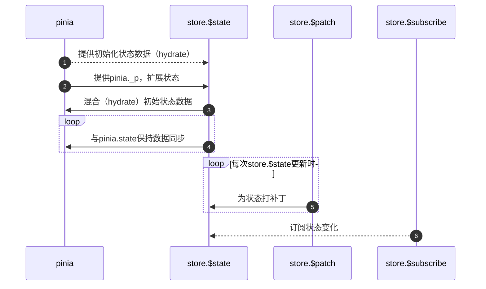

# 前言

Pinia是Vue.js的一个状态管理库，它可以辅助实现跨组件、页面状态共享，也是Vuex的替代方案。本篇将从Pinia的API作为入口分析其源码，最后简单探讨其设计。

> - Pinia版本：v2.1.7；
> - 仓库地址：[https://github.com/vuejs/pinia](https://github.com/vuejs/pinia)；
> - 官网地址：[https://pinia.vuejs.org/](https://pinia.vuejs.org/)；
> - 阅读本篇强烈建议将源代码拉取到本地用于辅助阅读，并且源代码提供了大量的类型注解详细到API RFCS，更易链接到外部知识点；
> - Pinia采用monorepo管理代码，packages包含`@pinia/nuxt`、`@pinia/testing`和`pinia`，本篇内容不会涉及单元测试和SSR相关，所以代码未经说明默认`pinia`目录。

# API源码分析

## createPinia

> 源码地址：src/createPinia.ts

`createPinia`中使用了`effectScope`，它可以自动收集同步函数中的`effect`、`computed`、`watch`、`watchEffect`，用于统一处理。`createPinia()`会返回Pinia实例，包含以下属性：

- `install`：Vue插件要求的方法，详情查看[Vue-插件](https://cn.vuejs.org/guide/reusability/plugins.html)；
- `state`：所有Store的状态收集（root state）

    ```ts
    type StateTree = Record<string | number | symbol, any>
    State: Ref<Record<string, StateTree>>
    // example
    const state: State = ref({
      'useStore': {
        'stateName1': {},
        'stateName2': {},
      }
    })
    ```

- `use`：添加Pinia插件
- `_p`：存放Pinia插件，在`app.use(pinia)`之前如果注册了Pinia插件，会被存放到`toBeInstalled`中，在`pinia.install()`时再插入到`_p`
- `_a`：app，即Vue实例
- `_e`：该Pinia实例的`effectScope`
- `_s`：通过该Pinia实例注册的Store

在`install`和`use`方法中会判断Vue版本，Vue3版本会将Pinia实例注入全局，并且可以通过`app.config.globalProperties.$pinia`访问pinia实例。

```ts
export function createPinia(): Pinia {
  const scope = effectScope(true)
  // NOTE: here we could check the window object for a state and directly set it
  // if there is anything like it with Vue 3 SSR
  const state = scope.run<Ref<Record<string, StateTree>>>(() =>
    ref<Record<string, StateTree>>({})
  )!

  let _p: Pinia['_p'] = []
  // plugins added before calling app.use(pinia)
  let toBeInstalled: PiniaPlugin[] = []

  const pinia: Pinia = markRaw({
    install(app: App) {
      // this allows calling useStore() outside of a component setup after
      // installing pinia's plugin
      setActivePinia(pinia)
      if (!isVue2) {
        pinia._a = app
        app.provide(piniaSymbol, pinia)
        app.config.globalProperties.$pinia = pinia
        toBeInstalled.forEach((plugin) => _p.push(plugin))
        toBeInstalled = []
      }
    },

    use(plugin) {
      if (!this._a && !isVue2) {
        toBeInstalled.push(plugin)
      } else {
        _p.push(plugin)
      }
      return this
    },

    _p,
    // it's actually undefined here
    // @ts-expect-error
    _a: null,
    _e: scope,
    _s: new Map<string, StoreGeneric>(),
    state,
  })

  return pinia
}
```

## useStore

> 源码地址：src/store.ts

`useStore`作为`defineStore`闭包存在，使用`defineStore`会返回**唯一的**`useStore`（`defineStore`内部会为`useStore`添加`$id`属性）。因为Store可能不在SFC中调用，`useStore()`获取pinia上下文会先判断是否存在组件实例——使用`hasInjectionContext`判断当前上下文是否可以使用`inject()`，如果可以返回`true`。然后再通过`inject(piniaSymbol, null)`尝试获取pinia实例，如果存在将其设置为`activePinia`。

```ts
  function useStore(pinia?: Pinia | null, hot?: StoreGeneric): StoreGeneric {
    const hasContext = hasInjectionContext()
    pinia =
      // in test mode, ignore the argument provided as we can always retrieve a
      // pinia instance with getActivePinia()
      pinia || (hasContext ? inject(piniaSymbol, null) : null)
    if (pinia) setActivePinia(pinia)

    pinia = activePinia!

    if (!pinia._s.has(id)) {
      // creating the store registers it in `pinia._s`
      if (isSetupStore) {
        createSetupStore(id, setup, options, pinia)
      } else {
        createOptionsStore(id, options as any, pinia)
      }
    }

    const store: StoreGeneric = pinia._s.get(id)!

    // StoreGeneric cannot be casted towards Store
    return store as any
  }
```

Store语法类型判断是在`defineStore`中、`useStore`生命前进行，根据结果值`isSetupStore`选择组合式语法`createSetupStore`或选项式语法`createOptionsStore`。

### createOptionsStore

`createOptionsStore`作用是通过选项式创建Store，其内部会将选项式参数转换为组合式语法参数，最后交由`createSetupStore`处理得到最终的Store。

```ts
function createOptionsStore<
  Id extends string,
  S extends StateTree,
  G extends _GettersTree<S>,
  A extends _ActionsTree
>(
  id: Id,
  options: DefineStoreOptions<Id, S, G, A>,
  pinia: Pinia,
  hot?: boolean
): Store<Id, S, G, A> {
  const { state, actions, getters } = options

  const initialState: StateTree | undefined = pinia.state.value[id]

  let store: Store<Id, S, G, A>

  /** setup */
  
  store = createSetupStore(id, setup, options, pinia, hot, true)

  return store as any
}
```

因为选项式中State是函数，为了保证其单例特性，`setup`中会根据`pinia.state`判断当前Store的State是否已经被声明。在`createSetupStore`也有类似的逻辑，但是那个逻辑主要是为了维护应用的稳健（可能会有人使用组合式和选项式声明同一个Store）。`setup`会返回`Record<string, Ref>`结构，它是`state`、`actions`和`getters`的混合。因为`getters`类似Vue中的计算属性，依赖State，所以这里`getters`使用`computed`包装并保证this指向。

```ts
function setup() {
  // avoid creating a state in pinia.state.value
  const localState = toRefs(pinia.state.value[id])

  return assign(
    localState,
    actions,
    Object.keys(getters || {}).reduce((computedGetters, name) => {

      computedGetters[name] = markRaw(
        computed(() => {
          setActivePinia(pinia)
          // it was created just before
          const store = pinia._s.get(id)!

          // allow cross using stores
          /* istanbul ignore if */
          if (isVue2 && !store._r) return

          // @ts-expect-error
          // return getters![name].call(context, context)
          // TODO: avoid reading the getter while assigning with a global variable
          return getters![name].call(store, store)
        })
      )
      return computedGetters
    }, {} as Record<string, ComputedRef>)
  )
}
```

### createSetupStore

> `createSetupStore`里面包含了Store的所有内置操作。代码多，这里分段展示。

首先是方法类型注解，这里可根据参数名去理解参数的含义，不用看泛型：

```ts
function createSetupStore<
  Id extends string,
  SS extends Record<any, unknown>,
  S extends StateTree,
  G extends Record<string, _Method>,
  A extends _ActionsTree
>(
  $id: Id,
  setup: () => SS,
  options:
    | DefineSetupStoreOptions<Id, S, G, A>
    | DefineStoreOptions<Id, S, G, A> = {},
  pinia: Pinia,
  hot?: boolean,
  isOptionsStore?: boolean
): Store<Id, S, G, A>
```

为Store的State设置响应式结构，在`createOptionsStore`中介绍过类似的一步，不过这里没有立即设置数据。

```ts
const initialState = pinia.state.value[$id] as UnwrapRef<S> | undefined
// avoid setting the state for option stores if it is set
  // by the setup
if (!isOptionsStore && !initialState && (!__DEV__ || !hot)) {
/* istanbul ignore if */
if (isVue2) {
  set(pinia.state.value, $id, {})
} else {
  pinia.state.value[$id] = {}
}
}
```

在`createOptionsStore`中，通过执行`setup()`获取State然后绑定到全局状态树（State Tree，`pinia.state.value`）。但在组合式语法中不能这么做，因为组合式语法返回的是一个普通对象（这也是不允许解构使用State的原因）。解决方案是通过`effectScope`收集响应式effect，但还需要作进一步的处理：

- 分离响应式数据，并保持数据同步；
- 分离action，并使用`wrapAction`包装action。

> `wrapAction`是为`store.$onAction`做铺垫的，简介属于Store内置方法，最后再介绍。

参看`if (initialState && shouldHydrate(prop)) { ... }`这段代码，上面的代码中有给出`initialState`的声明，这里有一个妙点，通过判断`initialState`是否为`undefined`来断定Store是否是第一次调用。如果不是第一次调用，会同步数据，间接单例约束Store。

`shouldHydrate`方法层级太高，这里不方便展示。大家可能对`hydrate`迷惑，举一个应用场景：页面刷新时状态重置。`hydrate`大致就是混合的意思，不过选项式语法提供了[hydrate](https://pinia.vuejs.org/zh/api/interfaces/pinia.DefineStoreOptionsInPlugin.html#hydrate)，组合式语法需要在Store定义之前为状态赋初始值。

```ts
const setupStore = runWithContext(() =>
  pinia._e.run(() => (scope = effectScope()).run(setup)!)
)!

// overwrite existing actions to support $onAction
for (const key in setupStore) {
  const prop = setupStore[key]

  if ((isRef(prop) && !isComputed(prop)) || isReactive(prop)) {
    // mark it as a piece of state to be serialized
    if (!isOptionsStore) {
      // in setup stores we must hydrate the state and sync pinia state tree with the refs the user just created
      if (initialState && shouldHydrate(prop)) {
        if (isRef(prop)) {
          prop.value = initialState[key]
        } else {
          // probably a reactive object, lets recursively assign
          // @ts-expect-error: prop is unknown
          mergeReactiveObjects(prop, initialState[key])
        }
      }
      // transfer the ref to the pinia state to keep everything in sync
      /* istanbul ignore if */
      if (isVue2) {
        set(pinia.state.value[$id], key, prop)
      } else {
        pinia.state.value[$id][key] = prop
      }
    }
    // action
  } else if (typeof prop === 'function') {
    // @ts-expect-error: we are overriding the function we avoid wrapping if
    const actionValue = wrapAction(key, prop)
    // this a hot module replacement store because the hotUpdate method needs
    // to do it with the right context
    /* istanbul ignore if */
    if (isVue2) {
      set(setupStore, key, actionValue)
    } else {
      // @ts-expect-error
      setupStore[key] = actionValue
    }
    // list actions so they can be used in plugins
    // @ts-expect-error
    optionsForPlugin.actions[key] = prop
  }
}
```

使用插件扩展Store。

```ts
pinia._p.forEach((extender) => {
  assign(
    store,
    scope.run(() =>
      extender({
      store: store as Store,
      app: pinia._a,
      pinia,
      options: optionsForPlugin,
    }))!
  )
})
```

`hydrate`的作用是Store初始化时，同步数据，和上面`shouldHydrate`那段作用类似，这里作用于选项式。

```ts
// only apply hydrate to option stores with an initial state in pinia
if (
  initialState &&
  isOptionsStore &&
  (options as DefineStoreOptions<Id, S, G, A>).hydrate
) {
  (options as DefineStoreOptions<Id, S, G, A>).hydrate!(
    store.$state,
    initialState
  )
}
```

接下来是处理Store的内置方法，先看下Store的数据结构（这里直接使用了源码的`partialStore`，因为该中间结构是为了解决开发、调试环境的问题，生产环境等同于结果值`store`）。

```ts
const store = {
  _p: pinia,
  $id,
  $state: undefined,
  $onAction: undefined,
  $patch: undefined,
  $reset: undefined,
  $subscribe: undefined,
  $dispose: undefined
}
```

### $state

store中的状态。

```ts
Object.defineProperty(store, '$state', {
  get: () => pinia.state.value[$id],
  set: (state) => {
    $patch(($state) => {
      assign($state, state)
    })
  },
})
```

### $onAction

`$onAction`相当于action触发的后置守卫，上面介绍`wrapAction`是对action的包装，更细节一些：`wrapAction`**绑定**（`setActivePinia(pinia)`）了action执行时的pinia实例，同时处理异步action。用户订阅action会将callback推入`actionSubscriptions`，action触发时会使用`triggerSubscriptions`方法触发callback。`addSubscription`和`triggerSubscriptions`的代码在`src\subscriptions.ts`文件中，这里不再展示。

```ts
let actionSubscriptions: StoreOnActionListener<Id, S, G, A>[] = []

store.$onAction = addSubscription.bind(null, actionSubscriptions)

/**
 * Wraps an action to handle subscriptions.
 *
 * @param name - name of the action
 * @param action - action to wrap
 * @returns a wrapped action to handle subscriptions
 */
function wrapAction(name: string, action: _Method) {
  return function (this: any) {
    setActivePinia(pinia)
    const args = Array.from(arguments)

    const afterCallbackList: Array<(resolvedReturn: any) => any> = []
    const onErrorCallbackList: Array<(error: unknown) => unknown> = []
    function after(callback: _ArrayType<typeof afterCallbackList>) {
      afterCallbackList.push(callback)
    }
    function onError(callback: _ArrayType<typeof onErrorCallbackList>) {
      onErrorCallbackList.push(callback)
    }

    // @ts-expect-error
    triggerSubscriptions(actionSubscriptions, {
      args,
      name,
      store,
      after,
      onError,
    })

    let ret: unknown
    try {
      ret = action.apply(this && this.$id === $id ? this : store, args)
      // handle sync errors
    } catch (error) {
      triggerSubscriptions(onErrorCallbackList, error)
      throw error
    }

    if (ret instanceof Promise) {
      return ret
        .then((value) => {
          triggerSubscriptions(afterCallbackList, value)
          return value
        })
        .catch((error) => {
          triggerSubscriptions(onErrorCallbackList, error)
          return Promise.reject(error)
        })
    }

    // trigger after callbacks
    triggerSubscriptions(afterCallbackList, ret)
    return ret
  }
}
```

### $patch

`$patch`作用是对state打补丁，最后的结果会混入到`pinia.state.value`中，这里主要内容是处理参数。可以看到补丁打上之后会立即执行一次。

```ts
function $patch(stateMutation: (state: UnwrapRef<S>) => void): void
function $patch(partialState: _DeepPartial<UnwrapRef<S>>): void
function $patch(
  partialStateOrMutator:
    | _DeepPartial<UnwrapRef<S>>
    | ((state: UnwrapRef<S>) => void)
): void {
  let subscriptionMutation: SubscriptionCallbackMutation<S>
  if (typeof partialStateOrMutator === 'function') {
    partialStateOrMutator(pinia.state.value[$id] as UnwrapRef<S>)
    subscriptionMutation = {
      type: MutationType.patchFunction,
      storeId: $id,
      events: debuggerEvents as DebuggerEvent[],
    }
  } else {
    mergeReactiveObjects(pinia.state.value[$id], partialStateOrMutator)
    subscriptionMutation = {
      type: MutationType.patchObject,
      payload: partialStateOrMutator,
      storeId: $id,
      events: debuggerEvents as DebuggerEvent[],
    }
  }
  // because we paused the watcher, we need to manually call the subscriptions
  triggerSubscriptions(
    subscriptions,
    subscriptionMutation,
    pinia.state.value[$id] as UnwrapRef<S>
  )
}
```

### $reset

`$reset`只能在选项式语法中使用，作用是重置State，重置方式是重新执行state得到新的状态集合，然后重新赋值给`$state`。

```ts
const $reset = isOptionsStore
  ? function $reset(this: _StoreWithState<Id, S, G, A>) {
      const { state } = options as DefineStoreOptions<Id, S, G, A>
      const newState = state ? state() : {}
      // we use a patch to group all changes into one single subscription
      this.$patch(($state) => {
        assign($state, newState)
      })
    }
  : noop
```

组合式语法可以通过`$patch`实现。

### $subscribe

订阅状态变化。

```ts

$subscribe(callback, options = {}) {
  const removeSubscription = addSubscription(
    subscriptions,
    callback,
    options.detached,
    noop
  )
  return removeSubscription
},
```

### $dispose

移除Store及其effects。

```ts
function $dispose() {
  scope.stop()
  subscriptions = []
  actionSubscriptions = []
  pinia._s.delete($id)
}
```

## mapHelpers

> 源码地址：src/mapHelpers.ts
> mapHelpers不是API，而是mapper类方法的集合

这里仅介绍`mapActions`，其他代码都在一个地方，代码逻辑相似。`mapActions`可以直接获取Store中的actions，[官网举例](https://pinia.vuejs.org/zh/api/modules/pinia.html#mapactions)。

```ts
/**
 * Allows directly using actions from your store without using the composition
 * API (`setup()`) by generating an object to be spread in the `methods` field
 * of a component.
 *
 * @param useStore - store to map from
 * @param keysOrMapper - array or object
 */
export function mapActions<
  Id extends string,
  S extends StateTree,
  G extends _GettersTree<S>,
  A,
  KeyMapper extends Record<string, keyof A>
>(
  useStore: StoreDefinition<Id, S, G, A>,
  keysOrMapper: Array<keyof A> | KeyMapper
): _MapActionsReturn<A> | _MapActionsObjectReturn<A, KeyMapper> {
  return Array.isArray(keysOrMapper)
    ? keysOrMapper.reduce((reduced, key) => {
        // @ts-expect-error
        reduced[key] = function (
          this: ComponentPublicInstance,
          ...args: any[]
        ) {
          return useStore(this.$pinia)[key](...args)
        }
        return reduced
      }, {} as _MapActionsReturn<A>)
    : Object.keys(keysOrMapper).reduce((reduced, key: keyof KeyMapper) => {
        // @ts-expect-error
        reduced[key] = function (
          this: ComponentPublicInstance,
          ...args: any[]
        ) {
          return useStore(this.$pinia)[keysOrMapper[key]](...args)
        }
        return reduced
      }, {} as _MapActionsObjectReturn<A, KeyMapper>)
}
```

从上面的代码可以看出，mapper其实是帮我们简化了Pinia内容的获取，并且扩展接口，使用户可以使用数组获取数据或使用键值对解构赋值数据。如果Store中存在副作用（比如`console.log`），不会跳过它们。

一般地项目中使用Store，可能会封装StoreManager这样的状态类统一管理Store，这个时候有必要参考这些mapper以规避小坑，比如`useStore($pinia)`：获取Store时会将Store所在的Pinia实例传进去。

## storeToRefs

官方解释是：创建一个引用对象，包含 store 的所有 state、 getter 和 plugin 添加的 state 属性。 类似于 toRefs()，但专门为 Pinia store 设计， 所以 method 和非响应式属性会被完全忽略。

```ts
/**
 * Creates an object of references with all the state, getters, and plugin-added
 * state properties of the store. Similar to `toRefs()` but specifically
 * designed for Pinia stores so methods and non reactive properties are
 * completely ignored.
 *
 * @param store - store to extract the refs from
 */
export function storeToRefs<SS extends StoreGeneric>(
  store: SS
): StoreToRefs<SS> {
  // See https://github.com/vuejs/pinia/issues/852
  // It's easier to just use toRefs() even if it includes more stuff
  if (isVue2) {
    // @ts-expect-error: toRefs include methods and others
    return toRefs(store)
  } else {
    store = toRaw(store)

    const refs = {} as StoreToRefs<SS>
    for (const key in store) {
      const value = store[key]
      if (isRef(value) || isReactive(value)) {
        // @ts-expect-error: the key is state or getter
        refs[key] =
          // ---
          toRef(store, key)
      }
    }

    return refs
  }
}
```

# 结构分析

上一节是以API为入口解析源码，但是有些盲人摸象，不能了解Pinia整体，本节将会从Pinia的抽象和依赖出发去分析Pinia的结构。先看Pinia官网上的一个问题解答——[为什么你应该使用 Pinia？](https://pinia.vuejs.org/zh/introduction.html#why-should-i-use-pinia)。

得益于Vue3的灵活性，Pinia很难和`export const state = reactive({})`拉开差距，但是如果纯粹使用后者实现WEB开发的状态管理，其实大部分项目都无法接受其带来的成本，也就是说Pinia在一些地方存在巨大的优势。

从API一节我们知道，Pinia实例创建后，`pinia`的`_s`、`_p`、`state`属性是连接其他API的核心，其中`state`属性最为关键。

```ts
// main.ts
const pinia = createPinia()
// useStore.ts
const UseStore = defineStore(() => {})
const useStore = UseStore()
```

假设项目中存在上面代码，我们通过时序图来了解Pinia实例和Store内部联系。



Pinia使用Store将一些states包裹住，然后使用复杂的逻辑以及依赖`vue-demi`来保持其响应式，实际上最后库的运行还是围绕那些states。本质没有改变，并且多了对`__DEV__`、`DevTools`、`HMR`、`SSR`、`Vue2`和`Vue3`的支持，以及不断的迭代带来的稳定性。再回到官网的那个问题，应该会有更新的了解。

# 总结

Pinia代码量少，很多风格与Vue系其他库相仿，适合作为Vue3这类大框架的**新手村**（比如由此扩展到`vue-demi`或API `effectScope`）。完事。

# 引用

- https://pinia.vuejs.org/