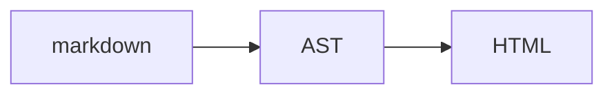
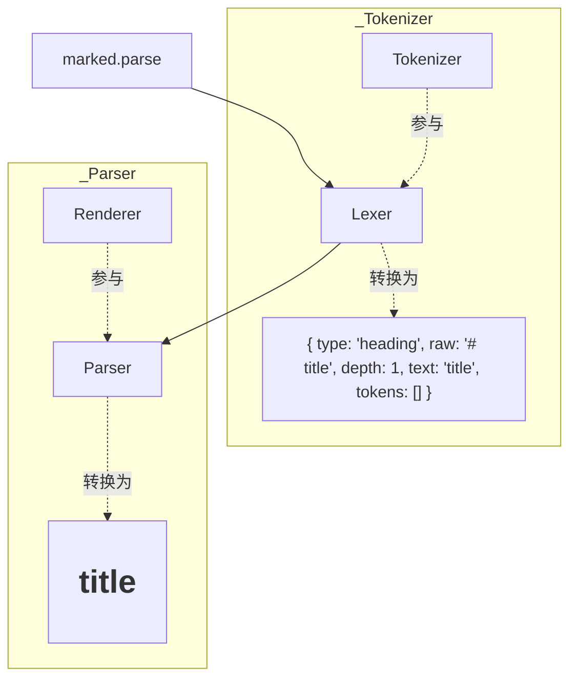

```zhenisbusy
{ "tagIds": ["前端"] }
```

项目中一般接触到的是富文本解析，很少对markdown深入。marked是一款markdown解析和编译的工具，相较于WangEditor等开源富文本组件，marked接触到的内容也更原始。本篇将从marked入手，探索其结构设计，分析利弊并完成简单应用。

# marked结构设计

> A markdown parser and compiler. Built for speed.

上面是marked GitHub页面的介绍，首先marked会将markdown文本解析成AST，再将AST转换为HTML文本。



这类设计在很多库和框架中都有应用，相较于它们marked并无特殊之处。对于只使用HTML结果的开发人员来说，生成AST是一个很鸡肋的过程，相当于要应用俩次状态机来转换内容，带来不必要的性能开销。但如果想要自定义HTML转换，AST是必要结构。如果只是后者，到这里可以止步，接下来要深入到marked代码。

marked有俩个状态机`Tokenizer`和`Renderer`，分别在`Lexer`和`Parser`中调度：



整体流程与`JSON.parse`类似，感兴趣可以去看leetcode上的这道题[2759. 将 JSON 字符串转换为对象](https://leetcode.cn/problems/convert-json-string-to-object/)。

# marked存在的局限

现阶段前端开发，如果直接将marked解析的HTML文本插入到`innerHTML`中，不符合组件复用思想，再者对于自定义内容或样式控制程度低。这个时候就需要高度使用AST，对应方法为`marked.lexer`，我们需要设计一些状态机并实现调度算法，同样和`JSON.parse`类似。

# 组件化简单应用

## 设计原则

1. 为了代码简洁易懂，不再将状态机和调度分离
2. 以Vue为例，所有状态机返回虚拟节点`VNode`，调度方法返回`VNode[]`

## 实现

```ts
class CustomMarked {
    prefix = 'markdown'
    
    parse (markdown: string) {
        const tokens = marked.lexer(markdown)
        return h ('div', {}, this.main(tokens))
    }
    /** 调度 */
    private main (tokens: Token[]) {
        const children = Array<VNode>()
        for (let i = 0; i < tokens.length; ++i) {
            let token = tokens[i]
            if (this[type] !== undefined) children.push((this[type] as any).call(this, token))
        }
        return children
    }
    /** 拼接前缀 */
    private concatPrefix (text: string) {
        return `${this.prefix} ${text}`
    }
    /** 生成HTML VNode，这里使用了一个`div`包裹 */
    html ({ text }: Tokens.HTML) {
        return this.generateVNode(
        'div',
        {
            class: this.concatPrefix('html'),
            innerHTML: text
        }
        )
    }
    /** 段落 */
    paragraph ({ tokens }: Tokens.Paragraph) {
        return this.generateVNode(
        'p',
        {
            class: this.concatPrefix('p'),
            'slide-enter': ''
        },
        this.main(tokens)
        )
    }
}
```

# 向JS主流框架设计靠齐

主流框架比如Vue3除了解析和编译，还考虑到了服务端渲染，当然这里不会实现服务端渲染，只是像Vue3那样，对一些内容进行高度抽象以实现跨平台、跨框架。比如组件创建方式、状态机覆盖等，然后这些都可以塞入option中（和marked一样），在初始化阶段实现替换。这里简单实现组件的抽象，也就是上面代码中的`generateVNode`方法：

```ts
    /**
     * 创建VNode：自动创建映射名
     * @param tagName 标签名
     * @param props props。使用undefined会自动创建class，修改class时候需字符串拼接。
     * @param children children
     * @returns VNode
     */
    private generateVNode (
        tagName: string,
        props: Record<string, any> = { class: this.concatPrefix(tagName) },
        children: string | VNode[] = ''
    ) {
        return h(tagName, props, children)
    }
```

配置覆盖:

```ts
class CustomMarked {
    constructor (option) {
        Object.assign(this, option.parser)
    }
}
```

# 引用
1. https://marked.js.org/
2. https://github.com/markedjs/marked
