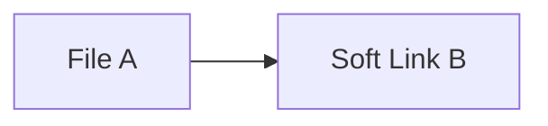
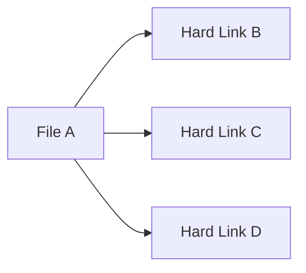

保持学习

# 算法
偏向于面试题高频题目，不论新旧。新工作之后再进阶。

# 前端

# 后端
## nestjs + typeorm浅入
## Django浅入
## 数据库浅入

# 运维
## docker

# 锻炼自己的集中力

## 软链接和硬链接
软链接相当于快捷方式，并且可以链接目录以及非本机地址。

这里删除A，C会指向无效位置。删除C对A无影响。

硬链接有点类似JS中对象的引用，只有全部硬链接删除后，文件才会被删除。

## 冲突域
下述很难确切场景
1. 在一个引用设计中，很多不方便规范化的东西应当被集合到一个区域，以缓解开发维护问题。这个区域被称为冲突域。
2. 冲突域应该是一个无输出区域，及不存在任何与其它模块或业务交互。
   1. 如果和其它区域重叠，应该被算入其它区域。
   2. 冲突域不应该与任何区域重叠。
3. 如何获取冲突域结果？
   1. 在冲突域与主线之间应该存在缓冲带，或者直接将主模块作为缓冲带
   2. 这并不代表冲突域会嵌入业务之中，因为主线的作用是调度